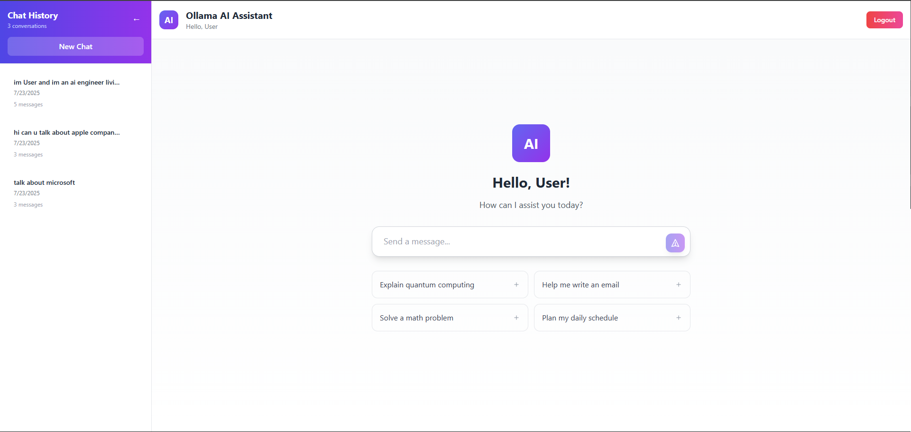

# 🤖 Ollama AI Assistant - Modern Web Interface

A beautiful, modern web interface for Ollama with real-time streaming responses, persistent chat history, and ChatGPT-style UI. Built with Next.js, TypeScript, and Tailwind CSS.



## ✨ Features

### 🎨 Modern Design
- **Glassmorphic UI** with beautiful gradients and animations
- **Responsive design** that works on desktop and mobile
- **Professional color schemes** with smooth transitions
- **Micro-interactions** and smooth animations

### 💬 Advanced Chat Experience
- **Real-time streaming** responses with typing effect
- **ChatGPT-style interface** - centered input on welcome, bottom on chat
- **Interactive suggestion cards** for quick prompts
- **Smart auto-scroll** that respects user position
- **Character-by-character streaming** for natural conversation flow

### 📚 Persistent Chat History
- **Session management** with automatic saving
- **Chat history sidebar** with organization
- **Cross-session memory** - AI remembers context across logins
- **Smart chat titles** generated from first user message
- **Delete confirmation** for chat safety

### 🔐 User Authentication
- **Secure login/signup** with email validation
- **Session persistence** across browser sessions
- **User-specific chat isolation**
- **Animated auth forms** with modern design

### 🚀 Performance & Technical
- **TypeScript** for type safety and better DX
- **Next.js 14** with optimized builds
- **Supabase** for database and auth
- **Real-time streaming** with proper error handling
- **Fast loading** and optimized performance

## Technology Stack

### Frontend

- **Framework**: Next.js 14 with React 18
- **Language**: TypeScript for type safety
- **Styling**: Tailwind CSS for responsive design
- **State Management**: React hooks and context

### Backend

- **API Layer**: Next.js API Routes
- **Database**: Supabase for user data and chat persistence
- **Authentication**: Supabase Auth with secure token management
- **AI Integration**: Ollama API for local model inference

### Development Tools

- **Linting**: ESLint with TypeScript rules
- **Type Checking**: TypeScript compiler with strict mode
- **Build System**: Next.js optimized build pipeline

## Architecture

```
ollama-assistant/
├── components/             # Reusable React components
│   ├── Auth.tsx           # Authentication forms and logic
│   └── Chat.tsx           # Main chat interface
├── lib/                   # Utility libraries and configurations
│   └── supabase.ts        # Supabase client setup
├── pages/                 # Next.js pages and API routes
│   ├── api/               # Backend API endpoints
│   │   ├── auth/          # Authentication handlers
│   │   │   ├── login.ts   # User login endpoint
│   │   │   └── signup.ts  # User registration endpoint
│   │   └── chat.ts        # Chat API with Ollama integration
│   ├── _app.tsx           # Application wrapper and global providers
│   └── index.tsx          # Landing page and main entry point
├── styles/                # Global styling
│   └── globals.css        # Tailwind CSS configuration
├── types/                 # TypeScript type definitions
│   └── index.ts           # Shared interfaces and types
├── .env.local             # Environment configuration
├── next.config.js         # Next.js build configuration
├── tailwind.config.js     # Tailwind CSS customization
├── tsconfig.json          # TypeScript compiler options
└── package.json           # Project dependencies and scripts
```

## Getting Started

### Prerequisites

Before running this application, ensure you have:

- Node.js version 18 or higher
- npm or yarn package manager
- Ollama installed and configured locally
- Supabase account (optional, fallback defaults provided)

### Installation Steps

1. **Clone and Install Dependencies**

   ```bash
   git clone <repository-url>
   cd ollama-assistant
   npm install
   ```

2. **Environment Configuration**

   Create a `.env.local` file in the root directory:

   ```env
   NEXT_PUBLIC_SUPABASE_URL=your_supabase_project_url
   NEXT_PUBLIC_SUPABASE_ANON_KEY=your_supabase_anonymous_key
   OLLAMA_URL=http://localhost:11434/api/generate
   ```

3. **Ollama Setup**

   Ensure Ollama is running and has the required model:

   ```bash
   ollama serve
   ollama pull llama3.2:3b
   ```

4. **Start Development Server**

   ```bash
   npm run dev
   ```

   The application will be available at `http://localhost:3000`

## Development Commands

| Command                  | Description                                        |
|--------------------------|----------------------------------------------------|
| `npm run dev`           | Start development server with hot reload           |
| `npm run build`         | Create production build                            |
| `npm run start`         | Start production server                            |
| `npm run lint`          | Run ESLint code analysis                          |
| `npm run type-check`    | Verify TypeScript types                           |

## API Documentation

### Authentication Endpoints

- **POST** `/api/auth/signup` - Register new user account
- **POST** `/api/auth/login` - Authenticate existing user

### Chat Endpoints

- **POST** `/api/chat` - Send message to AI model and receive response

### Request/Response Format

```typescript
// Chat API Request
interface ChatRequest {
  message: string;
  conversation_id?: string;
}

// Chat API Response
interface ChatResponse {
  response: string;
  conversation_id: string;
  error?: string;
}
```

## TypeScript Implementation

### Type Definitions

The application uses comprehensive TypeScript types for enhanced development experience:

```typescript
interface Message {
  role: 'user' | 'assistant';
  content: string;
  timestamp: Date;
}

interface User {
  id: string;
  email: string;
  created_at: Date;
}

interface Conversation {
  id: string;
  user_id: string;
  messages: Message[];
  created_at: Date;
  updated_at: Date;
}
```

### Configuration

TypeScript is configured with strict settings including:

- Strict null checks for safer code
- No implicit any types
- Unused variable detection
- Import/export validation

## Deployment

### Vercel Deployment

1. Connect your repository to Vercel
2. Configure environment variables in the Vercel dashboard
3. Deploy automatically on each push to main branch

### Manual Deployment

1. Build the application:

   ```bash
   npm run build
   ```

2. Start the production server:

   ```bash
   npm run start
   ```

## Configuration Guide

### Ollama Configuration

Ensure your Ollama installation has the required model:

```bash
ollama list  # Check installed models
ollama pull llama3.2:3b  # Install if not present
```

### Supabase Setup

1. Create a new project at supabase.com
2. Navigate to Settings > API to find your credentials
3. Update your `.env.local` file with the project URL and anonymous key
4. Configure Row Level Security policies for the chat tables

### Environment Variables

| Variable                              | Description                                   | Required |
|---------------------------------------|-----------------------------------------------|----------|
| `NEXT_PUBLIC_SUPABASE_URL`          | Supabase project URL                          | Yes      |
| `NEXT_PUBLIC_SUPABASE_ANON_KEY`     | Supabase anonymous key                        | Yes      |
| `OLLAMA_URL`                         | Ollama API endpoint                          | No       |

## Troubleshooting

### Common Issues

**Ollama Connection Failed**

- Verify Ollama is running: `ollama serve`
- Check if the model is installed: `ollama list`
- Ensure port 11434 is not blocked

**TypeScript Compilation Errors**

- Run `npm run type-check` for detailed error information
- Verify all dependencies are installed: `npm install`
- Check tsconfig.json for configuration issues

**Authentication Problems**

- Verify Supabase credentials in `.env.local`
- Check Supabase project status and configuration
- Ensure environment variables are properly loaded

**Build or Runtime Errors**

- Clear Next.js cache: `rm -rf .next`
- Reinstall dependencies: `rm -rf node_modules && npm install`
- Check for version compatibility issues

### Performance Optimization

- Use Next.js Image component for optimized image loading
- Implement proper error boundaries for better user experience
- Monitor bundle size and implement code splitting where necessary
- Configure proper caching strategies for API responses

## Contributing

We welcome contributions to improve this project. Please follow these guidelines:

1. Fork the repository and create a feature branch
2. Ensure all TypeScript types are properly defined
3. Run the full test suite: `npm run type-check && npm run lint`
4. Submit a pull request with detailed description of changes

## License

This project is licensed under the MIT License. See the LICENSE file for details.

## Support

For technical support or questions:

- Review the troubleshooting section above
- Check the GitHub issues for known problems
- Create a new issue with detailed error information and environment details
